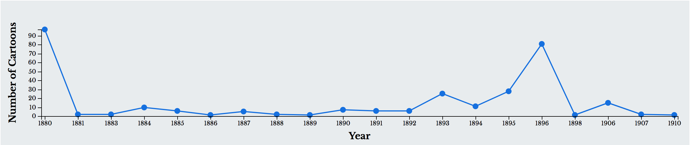
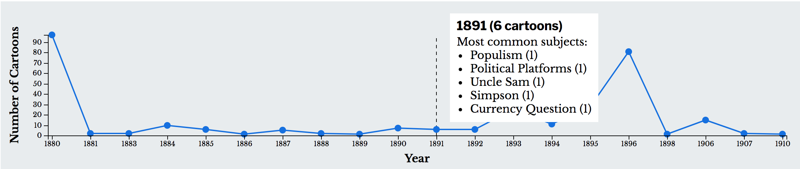
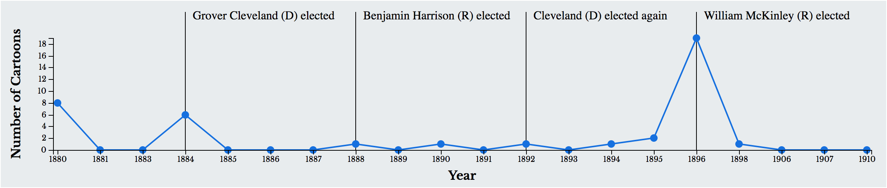

# Drawing Graphs
The main timeline for this app (see below) is created using D3 in [graph.js](https://github.com/jeffreyshen19/political-cartoon-visualizer/blob/master/src/JS/graphs.js). 

 

## Objective 
The goal of the timeline is to show the number of cartoons, per year, sorted by subject. Therefore, the graph should be able to update in accordance with user input. Hovering on the graph should also display a relevant tooltip (see below).

 

Also, for several subjects, events should show up on the timeline (see below) to historically contextualize the graph.

 

## Implementation
This is done through the `drawGraph` function. Most of this function is just drawing a standard D3 line graph, so I won't go into that here, but there are several unique features to discuss, namely the tooltip, superimposing event data, and how the graph updates.

### Tooltip

### Event Data
When the script is initialized in [init.js](https://github.com/jeffreyshen19/political-cartoon-visualizer/blob/master/src/JS/init.js), the object `eventData` is set to the JSON contained in [events.json](https://github.com/jeffreyshen19/political-cartoon-visualizer/blob/master/data/events.json)

```
$.get("./data/events-min.json", function(d){
  eventData = d;
  drawGraph(currentData);
  ...
});
```

`eventData` will contain all the events we want to display on the timeline. This is displayed through `drawGraph`. The first part (see below) gets the currently selected subject from the dropdown, and filters eventData so it is only events with that subject.  

```
var e = document.getElementById("select-subject");
var subject = e.options[e.selectedIndex];
subject = subject ? subject.value : "Everything";

var specificEventData = [];
for(var i = 0; i < eventData.length; i++){
  if(eventData[i].subject == subject){
    specificEventData = eventData[i].data;
    break;
  }
}
```
The next part (see below) displays this data on the graph. For each event, the code appends a group tag (g) which contains the line drawn on the timeline, and the text label.
```
var eventSelection = thisNode.select('svg').selectAll("g")
    .data(specificEventData).enter().append("g");

  eventSelection.append("line").attr("x1", function(d){return x(d.year) + margin.left;})
    .attr("x2", function(d){return x(d.year) + margin.left;})
    .attr("y1", y(0) + margin.top)
    .attr("y2", function(d, i){return 15;})
    .style("stroke", "black")
    .style("stroke-width", "1");
  eventSelection.append("text")
    .html(function(d){
      return d.name.split("\n").map(function(el){ //This part enters the line breaks in the labels
        return "<tspan x = '" + (x(d.year) + margin.left + 10) + "' dy = '15px'>" + el + "</tspan>";
      }).join("");
    })
    .attr("x", function(d){return x(d.year) + margin.left + 10;})
    .attr("y", function(d, i){return 10;});
``` 

### Updating the graph

IN PROGRESS:

```
var margin = {left: 70, right: 20, top: 50, bottom: 50};
var blue = "#0984e3";

//Draws the line chart
function drawGraph(data){
  var height = 250 - margin.top - margin.bottom,
      width = d3.select("#graphs").node().offsetWidth - margin.left - margin.right;
  var checked = document.getElementById("scale-graph").checked;
  var thisNode = d3.select("#main-graph");
  thisNode.select('svg').selectAll("*").remove();

  thisNode.append("div")
    .attr("class", "tooltip hidden")
    .style("position", "absolute")
    .style("background", "white")
    .style("padding", "10px")
    .style("bottom", "70px")
    .style("white-space", "nowrap");

  var tooltip = thisNode.select(".tooltip"),
      tooltipLine = thisNode.select(".tooltip-line");

  x.invert = d3.scaleQuantize().domain(x.range()).range(x.domain());

  var svg = thisNode.select("svg")
    .attr("width", width + margin.left + margin.right)
    .attr("height", height + margin.top + margin.bottom)
    .append("g")
      .attr("transform", "translate(" + margin.left + "," + margin.top + ")");

  thisNode.on("mousemove", function(){
    var x0 = x.invert(d3.mouse(this)[0] - margin.left),
        d;

    for(var i = 0; i < data.length; i++) {
      if(data[i].year == x0) {
        d = data[i];
        break;
      }
    }

    tooltip.classed("hidden", false)
      .html("<h3>" + d.year + " (" + d.cartoons.length + " cartoons)</h3>" + (!subject || subject == "Everything" ? "<p>Most common subjects:</p><ul>" + d.subjects.map(function(subject){
        return "<li>" + stylize(subject.subject) + " (" + subject.occurences + ")</li>";
      }).join("") + "</ul>" : ""))
      .style("left", (20 + x(d.year) + tooltip.node().offsetWidth > width ? x(d.year) + margin.left - 20 - tooltip.node().offsetWidth : x(d.year) + margin.left + 20) + "px");

    tooltipLine.attr("x1", x(d.year) + margin.left)
      .attr("x2", x(d.year) + margin.left)
      .classed("hidden", false);
  })
  .on("mouseout", function(d){
    var e = d3.event.toElement;
    if(e && e.parentNode.parentNode != this.parentNode && e.parentNode != this.parentNode && e != this.parentNode) {
      tooltip.classed("hidden", true);
      tooltipLine.classed("hidden", true);
    }
  });

  svg.append("path")
    .data([data])
    .attr("class", "line")
    .style("stroke", blue)
    .style("stroke-width", "2px")
    .style("fill", "none")
    .attr("d", line);

    svg.selectAll(".dot")
      .data(data)
      .enter().append("circle")
      .attr("class", "dot")
      .style("fill", blue)
      .attr("cx", function(d){return x(d.year);})
      .attr("cy", function(d, i){return y(checked ? d.cartoons.length / originalData[i].cartoons.length: d.cartoons.length);})
      .attr("r", 5);
}

```
