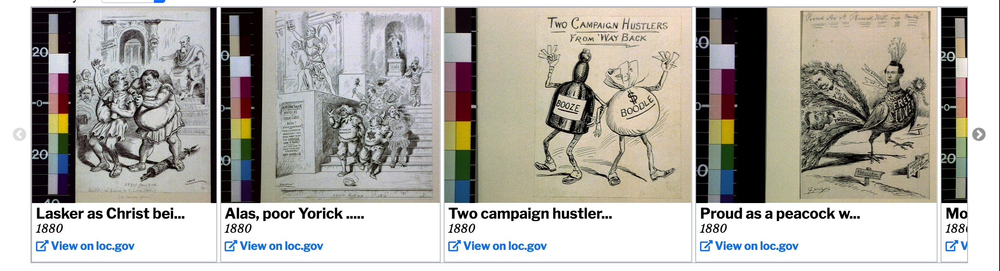

# Image Slideshow

## Objective
A key desire for the website was to display the images of political cartoons. As there are hundreds of images in total, I thought an effective way to display them would be to use an image slideshow (see below). 



The goal is that this image slideshow updates whenever the timeline is updated.

## Implementation 
The slideshow is done through the Javascript library Slick, so the actual creation of the slideshow won't be discussed here. Rather, I'll go over the configuration of the Slick slideshow and the updating of the slideshow. 

### Configuration
This is the configuration for the Slick slideshow (found in [image-slideshow.js](https://github.com/jeffreyshen19/political-cartoon-visualizer/blob/master/src/JS/image-slideshow.js)):

```
$("#images").slick({
  dots: false, //Disables the slideshow position dots, as there would be way too many dots
  //This is to responsively size the slideshow: as many images that can fit in the slideshow are displayed at a time
  slidesToShow: 1, 
  variableWidth: true,
  //Enable arrow controls
  accessibility: true,
  arrows: true,
  //Don't enable loop scrolling
  infinite: false,
  slidesToScroll: 2
});
```


### Updating 
The slideshow is updated everytime the timeline is updated, and is done by deleting the slideshow and regenerating it with new images: 

```
$('#images').slick("unslick");
  d3.select("#images").selectAll("*").remove();
  d3.select("#images").selectAll(".image")
    .data(images)
    .enter().append("div")
      .attr("class", "image")
      .html(function(d){
        return "<div class = 'caption'><h3>" + truncate(d.title) + "</h3><p>" + d.date + "</p><a href = '" + d.url + "' target = '_blank'><i class='fas fa-external-link-alt'></i> View on loc.gov</a></div>";
      });
      
$("#images").slick({
  dots: false,
  slidesToShow: 1,
  variableWidth: true,
  accessibility: true,
  arrows: true,
  infinite: false,
  slidesToScroll: 2
});
```
This code destroys the slideshow, replaces the images inside the slideshow, and re-executes Slick.
